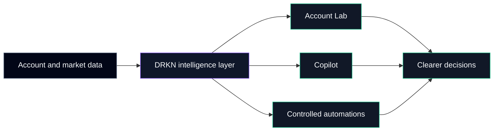

# DRKN

> AI-native intelligence for clearer crypto decisions.

## Our vision

Crypto platforms make it easy to see balances, positions, and prices. They do
not always make it easy to understand how those signals fit together.

DRKN is building an intelligence layer for traders who want clearer account
context, explainable risk insight, and practical assistance before they act.
The platform moves deliberately from understanding to guidance to optional
automation—without treating complexity as a feature.

## What DRKN brings together

| Capability | What it enables |
|---|---|
| Account intelligence | Turn account and position data into structured, explainable findings |
| AI Copilot | Explore account and market context through a focused conversational interface |
| Controlled automation | Create deliberate workflows with visible scope and operator control |
| Market context | Connect account-level decisions with broader market information |
| Content intelligence | Deliver timely research and educational context across the experience |

## Platform model

The architecture separates data, intelligence, product experiences, and
automation so each layer can evolve without blurring user control or product
responsibility.

## Core products

### Account Lab

An explainable view of account health and risk. Account Lab organizes
measurable signals into clear pillars and findings, helping traders see what
deserves attention.

### Copilot

An AI assistant grounded in account and market context. Copilot is designed to
support analysis and exploration—not to promise outcomes.

### Automations

Tools for creating explicit, controlled workflows. Automation follows
understanding and remains a deliberate operator choice.

## Repository map

| Repository | Focus |
|---|---|
| `drkn-web` | Product experience, interaction design, and frontend platform |
| `drkn-backend` | Intelligence services, market systems, and product capabilities |
| `drkn-content` | Research, editorial intelligence, and media workflows |
| `drkn-infra` | Platform reliability, delivery standards, and engineering operations |

## Engineering philosophy

- **Explainability over opacity.** Important findings should be understandable.
- **Control over surprise.** Assistance and automation should have visible boundaries.
- **Evidence over hype.** We do not make unverified performance or return claims.
- **Modularity over coupling.** Clear ownership helps teams and systems evolve safely.
- **Quality as a product feature.** Testing, observability, and reproducibility shape the user experience.
- **Progressive capability.** Understand first, get assistance second, automate when appropriate.

## Technology categories

| Category | Focus |
|---|---|
| AI systems | Contextual assistance, structured intelligence, and explainable outputs |
| Market technology | Exchange connectivity, market context, and trading-domain models |
| Product engineering | Responsive web experiences and real-time interaction |
| Automation | Event-driven workflows, orchestration, and operator controls |
| Content systems | Research workflows, structured publishing, and media automation |
| Platform engineering | Reliability, delivery quality, and operational visibility |

## Building responsibly

DRKN is designed for people seeking better context—not guaranteed returns or
opaque autonomous trading. We approach financial software with a calm,
precise, and risk-aware engineering culture.

## Work with us

The DRKN organization is structured around clear product and engineering
ownership. Developers can explore the repository map above to understand each
area of the platform and its contribution standards.

**Website:** not published · **Social channels:** not published
