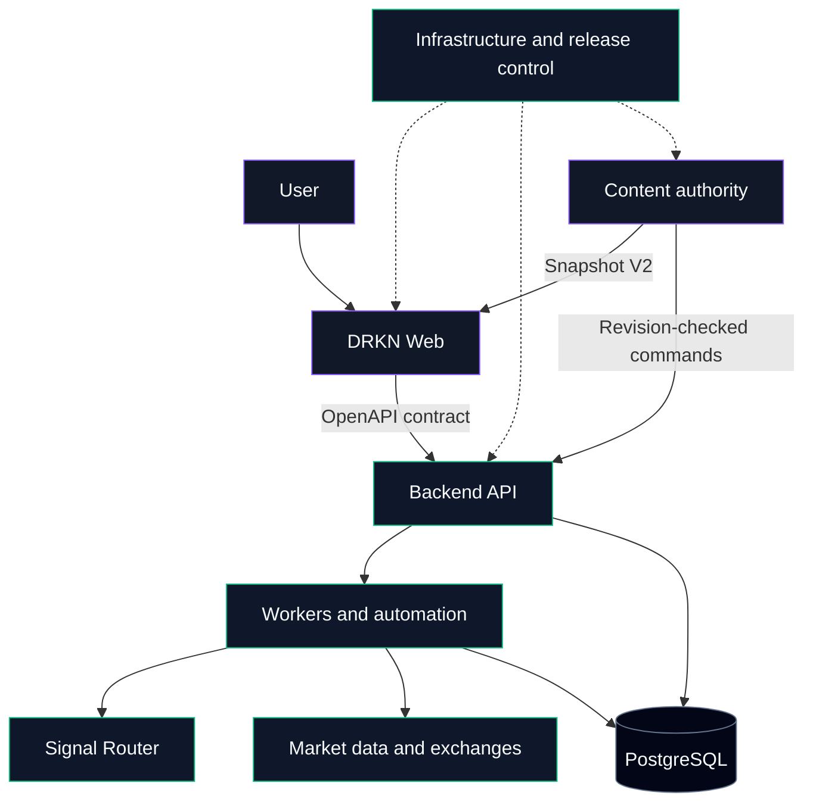
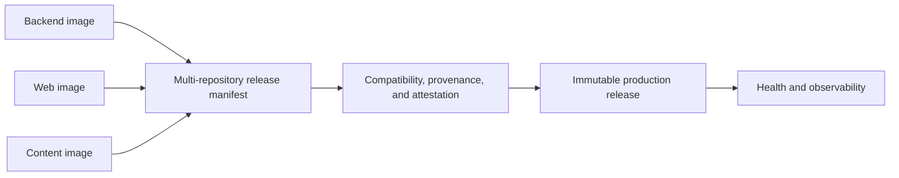

# DRKN

> AI-native trading intelligence infrastructure

**Logo placeholder:** dark navy / electric violet / signal green

## About DRKN

DRKN is an AI-powered crypto intelligence and trading infrastructure platform.
It combines account analysis, an operator copilot, automation, market-data
processing, content delivery, and financial execution controls behind explicit
service and artifact contracts.

The platform is organized as four independently versioned repositories. Each
repository has one source-of-truth responsibility and communicates across
boundaries through versioned APIs, snapshots, and release manifests.

## Architecture

Release flow:

## Core products

| Product | Responsibility |
|---|---|
| Account Lab | Explainable account scoring, risk pillars, and findings |
| Copilot | AI-assisted market and account intelligence |
| Automations | Deterministic event, queue, and workflow execution |
| Signal Router | Idempotent signal routing and delivery controls |
| Content platform | Versioned editorial authority, Snapshot V2, and publishing pipelines |

## Repository map

| Repository | Source authority | Runtime output |
|---|---|---|
| `drkn-web` | React user experience and public content presentation | Immutable static web image |
| `drkn-backend` | FastAPI, financial domain, workers, OpenAPI, and migrations | API and worker image |
| `drkn-content` | Editorial state, publication policy, and media workflows | Content authority and worker image |
| `drkn-infra` | Release contracts, Docker orchestration, observability, and rollback | Signed multi-repository release |

## Technology stack

| Layer | Technologies |
|---|---|
| Web | React, TypeScript, Vite, Tailwind CSS, nginx |
| Services | Python 3.13, FastAPI, Pydantic, background workers |
| Data | PostgreSQL, Redis, immutable content snapshots |
| Delivery | Docker, Compose, GitHub Actions, GHCR |
| Operations | Prometheus, Grafana, Alertmanager, structured logs |

## Engineering principles

- Explicit ownership: one authoritative repository for each responsibility.
- Contracts over source coupling: OpenAPI, Snapshot V2, and artifact manifests.
- Immutable delivery: releases and images are addressed by digest, not branch name.
- Fail-closed financial safety: deployment checks never bypass execution guards.
- Reproducible runtime: lock-based builds with no production source mounts.
- Observable systems: release identity, health, logs, and metrics are operational contracts.

## Security philosophy

DRKN treats financial execution, credentials, release provenance, and content
publication as distinct trust boundaries. Secrets are injected only at
runtime. CI uses mocked or dry-run integrations and never places trades, sends
user-visible messages, or publishes external content.

Please use GitHub private vulnerability reporting from the affected
repository's **Security** tab. Do not disclose suspected vulnerabilities in a
public issue.

## Contribution philosophy

Changes should be small, testable, and owned by the repository that controls
the behavior. Contract changes require compatibility evidence. Production
behavior, database authority, financial safeguards, and publishing side
effects must remain explicit in every pull request.

See the organization contribution and security policies before opening a
change. Public contribution intake is intentionally limited while operational
and disclosure workflows mature.

---

**Website:** not published · **Social channels:** not published
